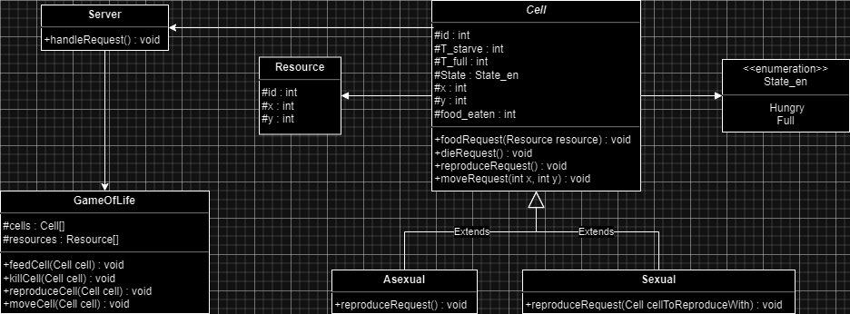

# The Game of Life

## Overview
The Game of Life is a simulation-based game consisting of different types of cells moving across a map, consuming resources and reproducing. There are two kind of cells: sexual and asexual. The difference between them lies in their reproduction methods. Sexual cells reproduce by encountering another sexual cell that is also seeking to reproduce, resulting in a third cell. Asexual cells reproduce through division. After consuming a certain amount of resources, an asexual cell will split, producing a new cell. The purpose of this game is to exemplify different concurrency issues that may appear in an application and how to solve them.

## How does it work

The user interacts with the game by providing the simulation data such as the number and type of cells spawning along with the number of resources on the map.

Once the game starts, the cells begin moving randomly on the map, consume the available resources and reproduce, thus populating the map.

Behind the scenes, each cell runs on its own thread and sends requests to the central server to specify what action it wants to take (moving, eating, reproducing). The server processes these requests and manages any concurrency issues that arise.

## Project structure

## Concurrency problems

### 1. Multiple cells trying to consume the same resource

This issue occurs when two or more cells try to consume the same resource on the map. The problem is solved by synchronizing the cell feeding method, thus only one cell can access the resource at a time.

### 2. Multiple sexual cells trying to reproduce with the same cell

This issue occurs when two or more sexual cells attempt to reproduce with the same partner cell at the same time. The problem is resolved by using a Reentrant Lock. Each sexual cell has its own lock, which it acquires when it begins looking for a partner. Once a potential partner is found, the cell acquires the partner's lock as well to ensure that the partner is indeed ready to reproduce. After reproduction is complete, both locks are released, and the cells' reproduction status is reset.
